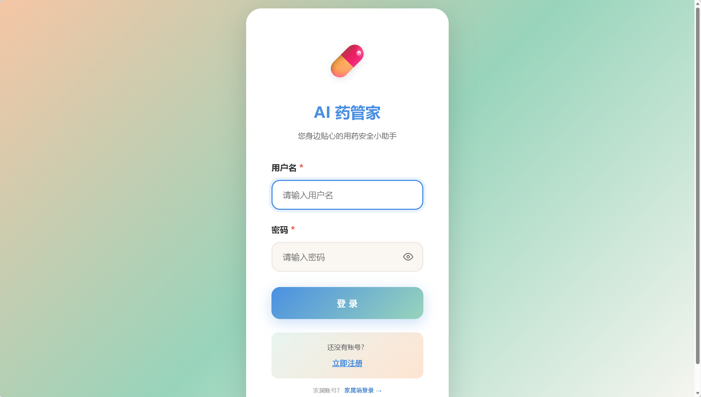
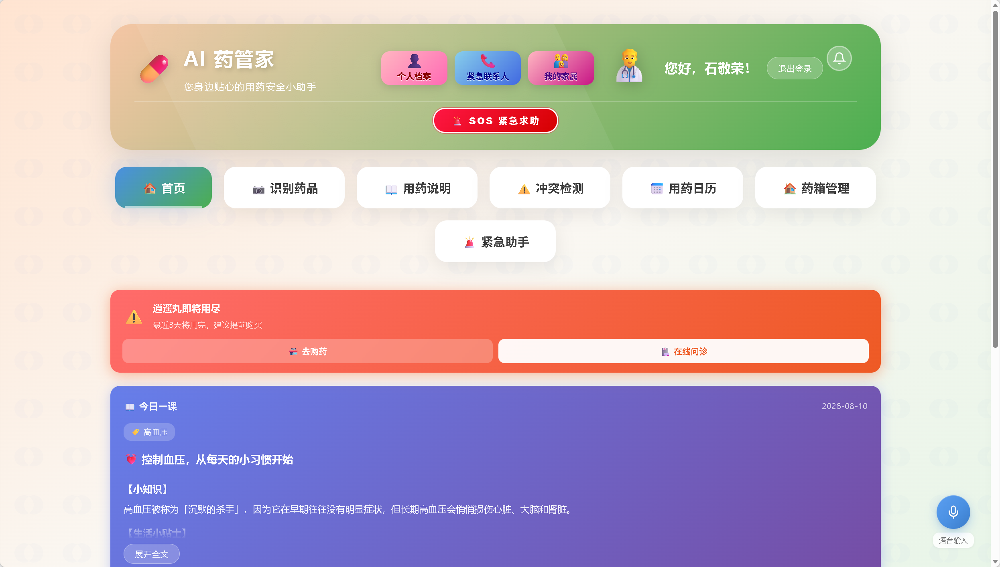
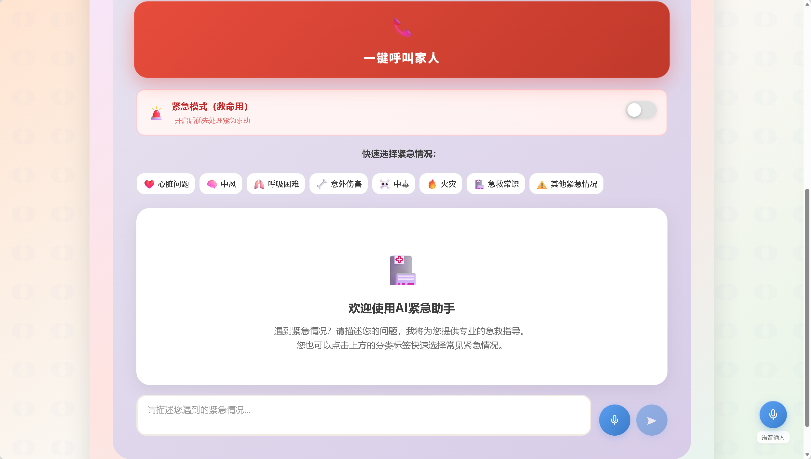
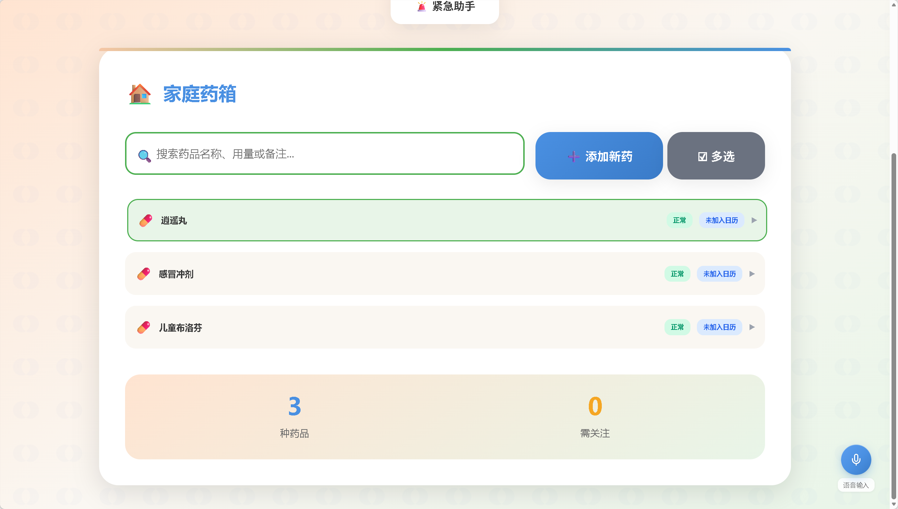
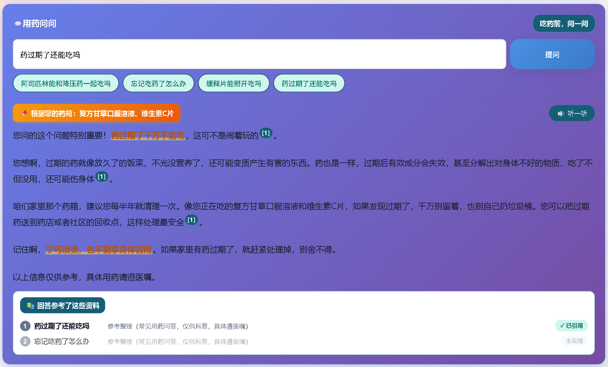
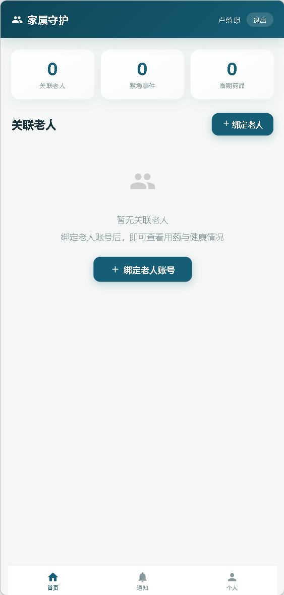
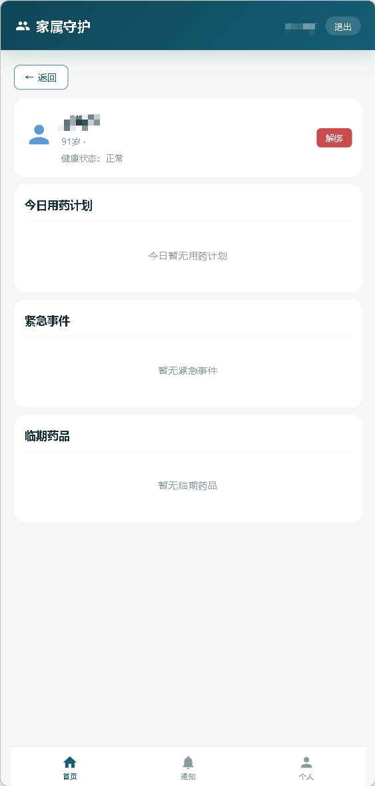

# AI紧急助手系统

> 🏥 专为老年人设计的智能用药安全与健康管理应用 —— AI 紧急咨询、用药冲突检测、按时服药提醒、家属远程监护

<p align="center">
  
  
  
  
  
  
</p>

**⭐ 如果这个项目对你有帮助,欢迎点个 Star,让更多人看到它!**

## 项目简介

AI紧急助手系统是一款专为老年人设计的智能健康助手，提供紧急情况下的急救指导、日常健康咨询、用药管理和家属监护等功能。系统分为**老人端**和**家属端**双端设计，老人端侧重用药管理与紧急求助，家属端侧重远程监护与通知接收。

核心亮点：**RAG 用药知识库**（933 条知识：药品 / 慢病指南 / FAQ）——AI 回答基于检索资料生成，**可溯源、降幻觉**；SSE 流式输出 + 药箱个性化（AI 知道老人真实在吃什么药）+ 三级离线降级（向量 → 关键词 → 本地直出），医疗场景离线可用。

## 技术栈

### 前端
- React 18 + React Scripts 5.0.1
- http-proxy-middleware 2.0.9
- 家属端：移动端风格（max-width: 480px，底部Tab导航）

### 后端
- Spring Boot 2.7.18 + MyBatis Plus 3.5.5
- MySQL 8.0 + Redis（缓存/异步链路）
- Spring Security + JWT（BCrypt 密码加密，无状态鉴权）
- Flyway 数据库版本管理（V1~V6 增量迁移，无需手动 SQL）
- Hutool 工具库
- 阿里云 OSS（药品图片存储，可选）
- 百度 OCR（药品包装识别）
- 百度 TTS（语音播报）
- DeepSeek AI（紧急咨询 / 用药指导 / 冲突分析 / RAG 生成）
- **SiliconFlow bge-m3（RAG 语义检索向量化，1024 维）**：未配 Key 自动降级内置哈希向量
- **RAG 检索增强生成**：向量检索 + 关键词倒排双路检索，三级降级（VECTOR→KEYWORD→LOCAL）
- **SSE 流式输出**：问答逐字返回，老人等待有实时反馈

## 开发计划

### AI 应用能力补齐

> 目标：补齐「交互与行动」能力，从问答助手升级为 AI 管家。

#### P0 基础体验（高优先级）

- [ ] 多轮对话上下文：`DeepSeekService` 生成时回传 `AiConversationLog` 历史（当前只存日志不回传，对话失忆）
- [x] SSE 流式输出：用药问问已实现（DeepSeek stream=true → SseEmitter → 前端打字机 + 失败自动回退非流式）；其余 AI 功能仍同步
- [ ] ASR 语音输入：接入百度语音识别，老人语音问药（当前只有 TTS 播报，无语音输入）

#### P1 智能化与合规

- [ ] Function Calling：AI 可调用系统工具（查药箱 / 建服药计划 / 标记漏服 / 通知家属）
- [ ] 回答质量评测集（20 题检索命中率评测）+ 前端「这个回答有用吗」反馈闭环
- [ ] 统一免责声明 + prompt 注入防护（防诱导泄露系统提示 / 给出危险剂量建议）

### RAG 用药知识库引入

> 目标：为现有 AI 能力补充「知识检索」环节（检索 → 增强 → 生成），让回答可溯源、降低医疗场景幻觉风险。

> **知识源设计（内容与代码分离）**：药品知识从 `drug_base` 表动态抽取（新增药品自动进知识库）；慢病指南/用药 FAQ 为 Markdown 资源文件（`resources/knowledge/guides|faqs/*.md`，带 YAML front-matter），**加知识 = 加一个 .md 文件**，重启自动入库。`source_ref` 字段标注知识来源（官方原文/参考整理/开源数据集），回答可溯源。
>
> **开源数据集采集**：`scripts/rag-dataset/collect_drug_kg.py` 从 CN-Drug-KG-800（HuggingFace，cc-by-nc-4.0）采集 817 种药品知识 → `resources/knowledge/drugs/*.md`，当前知识库规模 **936 条**（药品 911 / 指南 10 / FAQ 12，含 drug_base 动态抽取）。

### 阶段一：知识库入库管线（P1）

- [x] 新增 `knowledge_chunk` 表（Flyway V5 迁移脚本）
- [x] 整理种子知识：药品说明书（动态抽取）/ 慢病指南（10 种，Markdown）/ 用药 FAQ（12 条，Markdown）
- [x] `RagIngestService`：扫描知识目录 → 切分 + bge-m3 向量化 + 落库（V6 加 `source_ref` 来源列）
- [x] 增量入库：`ingestDrug()` 幂等增量（新药入库自动向量化进知识库，同步 hook + 接口；Redis Streams 异步为备选方案）

### 阶段二：检索核心（P2）

- [x] `VectorStore`：内存向量索引 + 余弦相似度 top-k 召回
- [x] `KeywordIndex`：本地关键词倒排索引（离线降级用）
- [x] 检索单测：23 个用例（KeywordIndex/VectorStore/Markdown 解析/降级策略，命中正确性 + 低分尾项过滤验证）

### 阶段三：RAG 问答接口（P3）

- [x] `RagService`：检索 → 增强 → 生成（引用注入 DeepSeek，支持用户药箱上下文个性化）
- [x] `POST /api/rag/ask` 接口，返回 `answer + sources[]`（含来源标注 sourceRef、药箱药品 userDrugs）
- [x] 前端「用药问问」问答页（老人端首页 RagAskCard，复用 elderFetch 鉴权）

### 阶段四：接入现有 AI 功能（P4）

- [x] 药品信息补全改用 RAG 检索（注入知识库资料，替换「靠模型记忆填写」）
- [x] 冲突检测回答带引用来源（检索药品知识注入 prompt）
- [x] 今日一课生成注入检索资料（基于慢病指南生成）
- [x] 原功能回归测试（冲突检测本地规则 / 今日一课 / ask 实测通过）

### 阶段五：离线降级与演示（P5）

- [x] 降级链路验证（LOCAL 实测通过；KEYWORD 检索经单测覆盖；embedding 断网自动降级哈希向量）
- [x] 演示话术与 demo 场景设计（docs/RAG演示话术.md：可溯源问答 / 药箱个性化 / 降级兜底 三个场景）

### 待确认

- [x] embedding 服务选型（已定：SiliconFlow bge-m3，未配 Key 自动降级内置哈希向量）
- [x] 前端问答入口位置（已定：老人端首页「今日一课」下方）

## 快速开始

### 环境要求

- Node.js >= 16.x
- JDK >= 11
- MySQL >= 8.0
- Maven >= 3.6

### 1. 克隆项目

```bash
git clone https://github.com/sjr666666/ai-elderly-health-assistant.git
cd aaagame
```

### 2. 数据库初始化（Flyway 自动迁移，推荐）

项目已集成 **Flyway** 数据库版本管理，**无需手动执行任何 SQL**：

1. 确保 MySQL 服务已启动，在 `application-local.properties` 中配置好密码（见下一步）
2. 直接启动后端，Flyway 会自动完成：
   - 库不存在时自动创建 `elderly_medication` 数据库（连接账号需有建库权限）
   - 按版本顺序执行 `db/migration/` 下的迁移脚本（V1 建表 → V2 基础数据 → V3/V4 结构演进）
   - 每次变更记录在 `flyway_schema_history` 表中，**升级时自动执行增量迁移**

迁移脚本一览：

| 版本 | 文件 | 说明 |
|------|------|------|
| V1 | `db/migration/V1__init_schema.sql` | 19 张核心表（用户/药品/计划/家属端等）+ 外键 |
| V2 | `db/migration/V2__init_data.sql` | 基础数据（5 个测试账号、完整药品库、关键词、别名） |
| V3 | `db/migration/V3__production_support.sql` | 生产支撑表（通知箱/异步任务/刷新会话） |
| V4 | `db/migration/V4__use_decimal_inventory_quantities.sql` | 药箱数量字段升级为 DECIMAL |
| V5 | `db/migration/V5__create_knowledge_chunk.sql` | RAG 知识切片表（title/content/embedding_json/关键词） |
| V6 | `db/migration/V6__add_knowledge_source_ref.sql` | 知识来源标注列 `source_ref`（回答可溯源） |

> **老库平滑升级**：已用旧脚本初始化过的数据库，首次启动会自动 baseline 到 V1 并执行后续增量迁移，不会重复建表。
>
> **手动脚本（已废弃，仅供排查参考）**：`init_database.sql` / `init_drug_data.sql` / `init_guardian_tables.sql` / `init_weekly_report_table.sql` 及 `init_database.bat/sh` 仍保留，但**新环境请直接使用 Flyway**，不要再手动执行，避免与迁移记录冲突。

### 3. 后端配置

创建本地配置文件 `application-local.properties`，该文件已被 `.gitignore` 忽略：

```bash
cp backend/src/main/resources/application-local.properties.example \
   backend/src/main/resources/application-local.properties
```

编辑 `application-local.properties`，填入以下配置：

```properties
# MySQL密码（必填）
spring.datasource.password=你的MySQL密码

# 阿里云OSS（可选，留空则禁用）
aliyun.oss.access-key-id=
aliyun.oss.access-key-secret=

# 百度OCR（药品包装识别）
baidu.ocr.app-id=your_baidu_ocr_app_id
baidu.ocr.api-key=your_baidu_ocr_api_key
baidu.ocr.secret-key=your_baidu_ocr_secret_key

# 百度TTS（语音播报）
baidu.tts.appId=your_baidu_tts_app_id
baidu.tts.apiKey=your_baidu_tts_api_key
baidu.tts.secretKey=your_baidu_tts_secret_key

# DeepSeek大模型（紧急咨询/用药指导/冲突分析/RAG回答生成）
deepseek.api-key=sk-your_deepseek_api_key_here

# SiliconFlow bge-m3（RAG语义检索，可选但强烈推荐）
# 不填则检索用内置降级向量（精度受限）；填了检索才"懂语义"（如"这药和降压药一起吃行不行"）
# 获取：https://cloud.siliconflow.cn 控制台 → API 密钥
siliconflow.api-key=sk-your_siliconflow_api_key_here
```

> 阿里云OSS的 `access-key-id` 留空时，系统会自动禁用OSS功能，不影响其他功能使用。

### 4. 启动后端

```bash
cd backend
mvn spring-boot:run
```

后端服务启动后访问: http://localhost:8080

### 5. 启动前端

```bash
cd frontend
npm install
npm start
```

前端服务启动后访问: http://localhost:3000

> 如果遇到代理问题，删除 `node_modules` 和 `package-lock.json` 后重新 `npm install`。

### 6. 测试账号

数据库初始化后可使用以下测试账号登录（密码统一为 `123456`）：

| 用户名 | 角色 | 姓名 | 备注 |
|--------|------|------|------|
| `laowang` | 老人 | 王阿姨 | 有家庭药箱与用药计划 |
| `laoli` | 老人 | 李大爷 | 冠心病/脑梗后遗症用药 |
| `zhangsan` | 家属 | 张三 | 绑定王阿姨 |
| `zhaosi` | 家属 | 赵四 | 绑定李大爷 |
| `xiaomei` | 家属 | 小美 | 磺胺过敏史 |

> 登录后系统根据角色自动跳转：老人 → 老人端首页，家属 → 家属端移动端页面。

### 7. Docker 一键部署（推荐）

项目已提供完整的 `docker-compose.yml`,一条命令拉起 MySQL + Redis + 后端 + 前端四个服务。

**第一步:准备环境变量**

```bash
cp .env.example .env
```

编辑 `.env`,至少填写以下必填项(其余可留空,对应的 AI/存储功能会自动禁用):

| 变量 | 说明 |
|------|------|
| `MYSQL_ROOT_PASSWORD` | MySQL root 密码(建议长随机串) |
| `MYSQL_APP_PASSWORD` | 应用账号 `medication_app` 的密码 |
| `REDIS_PASSWORD` | Redis 密码 |
| `JWT_SECRET` | JWT 签名密钥(**至少 32 字符**) |
| `PHONE_ENCRYPT_KEY` | 手机号加密密钥 |
| `APP_CORS_ALLOWED_ORIGINS` | 允许的前端来源,如 `http://localhost` |
| `DEEPSEEK_API_KEY` | DeepSeek 大模型 Key（AI 回答生成，可选） |
| `SILICONFLOW_API_KEY` | SiliconFlow bge-m3 语义检索 Key（RAG 检索精度关键，可选） |

**第二步:启动**

```bash
docker compose up -d --build
```

**第三步:访问**

- 前端: http://localhost (默认 `HTTP_PORT=80`,可在 `.env` 修改)
- 后端 API: http://localhost:8080

**说明:**

- 数据库表结构与基础数据由后端启动时的 **Flyway 自动迁移** 完成(见上「数据库初始化」),无需手动执行 SQL
- 数据持久化在 Docker volumes(`mysql-data` / `redis-data` / `uploads-data`),删除容器不会丢数据
- 停止服务: `docker compose down`;彻底清理(含数据): `docker compose down -v`
- 开发模式热更新: `docker compose -f docker-compose.dev.yml up`(代码挂载 + 端口映射 3000/8080)
- HTTPS 部署: 参考 `docker-compose.https.yml`(需配置证书)

## 项目文档

| 文档 | 内容 |
|------|------|
| [RAG实现讲解.md](./docs/RAG实现讲解.md) | RAG 原理 + 本项目实现逐段讲解 + 面试 Q&A（入门） |
| [RAG实现讲解2-进阶.md](./docs/RAG实现讲解2-进阶.md) | 循环依赖解耦 / P4 接入法 / 检索质量兜底 / 引用体系 / 流式（进阶） |
| [RAG演示话术.md](./docs/RAG演示话术.md) | 竞赛演示 3 个场景（可溯源问答 / 药箱个性化 / 降级兜底）+ 答辩备答 |

## 功能截图

### 老人端

登录界面(渐变色 + 大字体设计,适配老年人视觉):



登录后的首页 — 集常用功能、SOS 紧急求助、今日一课健康科普于一体:



AI 紧急助手 — 红色呼叫家人一键直达,8 大紧急情况分类标签引导:



家庭药箱 — 搜索 / 新增 / 多选,药品状态一目了然:



用药问问 — RAG 用药知识问答：可点击引用溯源、药箱个性化、大字条目化、荧光笔高亮、快捷提问:



### 家属端(移动端风格)

仪表盘 — 关联老人、紧急事件、临期药品三项核心指标:



老人详情 — 今日用药计划、紧急事件、临期药品分块展示,一屏掌握:



## 功能特性

### 老人端

#### AI 紧急咨询
- 紧急情况智能问答（自动判断问题是否紧急）
- 多分类标签引导（用药 / 症状 / 急救等）
- 对话历史记录与上下文记忆
- AI 老年友好用药指导生成（DeepSeek）

#### 药品管理
- 药品字典查询（关键词 / 类别 / 别名）
- AI 智能搜索（支持别名、商品名解析）
- 家庭药箱 CRUD（增删改查、状态过滤）
- 药品图片识别（百度 OCR + 阿里云 OSS）
- 批量药品图片识别与确认入库
- 药品到期 / 过期自动提醒（30 天预警）

#### 药品冲突检测
- 多药品冲突检测（DeepSeek AI 深度分析）
- 本地规则快速检测（不依赖 AI，适合自动场景）
- 结合健康档案个性化分析（BMI / 慢病 / 肝肾功能 / 烟酒史等）
- 新药入箱自动检测并告警

#### 用药计划与提醒
- 今日 / 本周用药计划视图
- 计划执行（确认 / 跳过 / 撤销，幂等操作）
- 根据家庭药箱自动生成每日计划
- 定时任务 + 前端轮询双通道提醒
- 用药记录追溯

#### 用户与健康档案
- 账号注册 / 登录（BCrypt 密码加密）
- 健康档案管理（年龄 / 身高体重 / 慢病 / 过敏史 / 肝肾功能 / 孕期哺乳 / 烟酒史）

#### 紧急联系人
- 多联系人增删改查
- 首个联系人自动设为主要联系人

#### 用药问问（RAG 用药知识问答）
- 检索增强生成：问题 → 语义检索知识库（933 条）→ AI 基于资料回答，**可溯源**
- **流式输出**：SSE 打字机效果，等待时动态反馈（"正在回答…"）
- **引用溯源**：回答中 [1][2] 编号可点击跳转对应资料，来源标注"已引用/未采用"
- **药箱个性化**：自动注入用户药箱真实用药（"根据您的药箱：XXX"），回答贴合本人情况
- 老人友好：大字条目化排版、重点荧光笔高亮、🔊 语音播报、快捷提问胶囊（免打字）
- 三级降级：向量检索 → 关键词倒排 → 本地直出，断网/无 Key 仍可用
- 知识外置：**加知识 = 加一个 .md 文件**（`resources/knowledge/`），重启自动入库

#### 多模态与体验
- 百度 TTS 语音播报（语速可调，老年人友好）
- 老年友好界面（大字体、高对比度）
- 离线模式支持（Service Worker）

### 家属端（移动端风格）

#### 仪表盘
- 关联老人数量、紧急事件数、通知数统计
- 今日用药状态实时显示（已服/待服/漏服）
- 老人列表快捷入口

#### 老人详情
- 老人基本信息与健康档案查看
- 紧急事件列表与处理（标记已处理）
- 临期药品预警
- 绑定/解绑老人

#### 通知记录
- 短信通知记录查看（漏服提醒、紧急事件、临期药品）
- 通知状态与发送详情

#### 绑定管理
- 通过老人用户名绑定/解绑
- 解绑后重新绑定自动恢复关联

## 项目结构

```
innovative-ideas-challenge/
├── backend/                          # 后端服务（Spring Boot）
│   ├── src/main/java/com/example/backend/
│   │   ├── common/                   # 通用工具（ResponseResult/SnowflakeId等）
│   │   ├── config/                   # 配置类（CORS/Security/OSS/OCR/TTS等）
│   │   ├── controller/               # 控制器层
│   │   │   ├── GuardianController    # 家属端API（9个端点）
│   │   │   ├── DrugController        # 药品管理
│   │   │   ├── PlanController        # 用药计划
│   │   │   ├── EmergencyController   # 紧急求助
│   │   │   ├── AiController          # AI对话
│   │   │   └── ...                   # 其他控制器
│   │   ├── mapper/                   # MyBatis Plus Mapper
│   │   ├── model/
│   │   │   ├── dto/                  # 数据传输对象
│   │   │   ├── entity/               # 数据库实体（15个）
│   │   │   └── vo/                   # 视图对象
│   │   ├── service/                  # 服务接口
│   │   │   ├── rag/                  # RAG 检索增强生成（Embedding/向量库/倒排索引/入库/问答）
│   │   │   │   ├── RagEmbeddingService   # 双策略向量化（bge-m3 / 本地哈希降级）
│   │   │   │   ├── VectorStore          # 内存向量索引 + 余弦 top-k
│   │   │   │   ├── KeywordIndex         # 中文 bigram 倒排索引（离线降级，标题加权）
│   │   │   │   ├── RagIngestService     # 知识入库（扫描 Markdown + 药品动态抽取）
│   │   │   │   ├── RagSearchService     # 纯检索层（向量/关键词 + 分数兜底过滤）
│   │   │   │   └── RagService           # 问答编排（检索→增强→生成，药箱个性化）
│   │   │   └── impl/                 # 服务实现
│   │   └── task/                     # 定时任务
│   ├── src/main/resources/
│   │   ├── knowledge/                # 知识库（Markdown，加知识=加文件）
│   │   │   ├── drugs/                #   药品知识（817 个，开源数据集）
│   │   │   ├── guides/               #   慢病指南（10 个）
│   │   │   └── faqs/                 #   用药 FAQ（12 条）
│   │   ├── db/migration/             # Flyway 迁移（V1~V6）
│   │   ├── init_database.sql         # 建库+基础表+测试数据
│   │   ├── init_drug_data.sql        # 完整药品数据
│   │   ├── init_guardian_tables.sql  # 家属端表
│   │   ├── application.properties    # 主配置
│   │   └── application-local.properties.example  # 本地配置模板
│   ├── scripts/rag-dataset/          # 开源数据集采集脚本（可复现）
│   ├── init_database.bat             # Windows初始化脚本
│   ├── init_database.sh              # Linux/Mac初始化脚本
│   └── pom.xml
├── frontend/                         # 前端应用（React）
│   ├── src/
│   │   ├── components/
│   │   │   ├── guardian/             # 家属端组件（移动端风格）
│   │   │   │   ├── GuardianApp.js    # 家属端主框架（Tab导航）
│   │   │   │   ├── GuardianLogin.js  # 家属端登录
│   │   │   │   ├── GuardianDashboard.js  # 仪表盘
│   │   │   │   ├── GuardianElderDetail.js # 老人详情
│   │   │   │   ├── GuardianNotification.js # 通知记录
│   │   │   │   └── guardian.css      # 家属端样式
│   │   │   ├── Login.js              # 老人端登录
│   │   │   ├── DrugListView.js       # 药箱管理
│   │   │   ├── EmergencyAssistant.js # AI紧急助手
│   │   │   ├── RagAskCard.jsx        # 用药问问（RAG 问答卡片，流式+引用）
│   │   │   └── ...                   # 其他老人端组件
│   │   ├── App.js                    # 根组件（角色路由）
│   │   └── setupProxy.js             # API代理配置
│   └── package.json
├── docs/                             # 文档
│   ├── RAG实现讲解.md                # RAG 原理+实现+面试 Q&A
│   ├── RAG实现讲解2-进阶.md          # 检索兜底/引用体系/流式/采集 进阶讲解
│   └── RAG演示话术.md                # 竞赛演示 3 个场景话术
└── README.md
```

## API 概览

### 家属端 API（GuardianController）

| 端点 | 方法 | 说明 |
|------|------|------|
| `/api/v1/guardian/dashboard` | GET | 仪表盘数据 |
| `/api/v1/guardian/elders` | GET | 关联老人列表 |
| `/api/v1/guardian/elders/{id}` | GET | 老人详情 |
| `/api/v1/guardian/bind` | POST | 绑定老人 |
| `/api/v1/guardian/unbind` | DELETE | 解绑老人 |
| `/api/v1/guardian/elders/{id}/events` | GET | 紧急事件列表 |
| `/api/v1/guardian/events/{id}/resolve` | PUT | 处理紧急事件 |
| `/api/v1/guardian/notifications` | GET | 通知记录 |
| `/api/v1/guardian/elders/{id}/expiring-drugs` | GET | 临期药品 |

### 老人端主要 API

| 模块 | 端点前缀 | 说明 |
|------|----------|------|
| 用户 | `/api/v1/user` | 注册/登录/档案 |
| 药品 | `/api/v1/drug` | 药品搜索/药箱管理 |
| 计划 | `/api/v1/plan` | 用药计划/服药确认 |
| AI | `/api/v1/ai` | 紧急咨询/用药指导 |
| OCR | `/api/v1/ocr` | 药品图片识别 |
| 冲突 | `/api/v1/drug-conflict` | 药品冲突检测 |
| 紧急 | `/api/v1/emergency` | 紧急联系人/SOS |

### RAG 用药知识库 API

| 端点 | 方法 | 说明 |
|------|------|------|
| `/api/rag/ask` | POST | 用药知识问答（body: `{"question":"..."}`），返回 answer + sources[]（含来源标注/药箱药品） |
| `/api/rag/ask/stream` | POST | SSE 流式问答（meta 来源 → delta 逐字 → done） |
| `/api/rag/ingest` | POST | 全量重灌知识库（换 embedding 后必须调用） |
| `/api/rag/ingest/drug/{id}` | POST | 单药增量入库（新药自动向量化） |
| `/api/rag/health` | GET | 知识库健康状态（切片数 / embedding provider） |

## 数据库表结构

> 由 Flyway 管理，共 23 张表，按迁移版本组织。

| 表名 | 说明 | 所属迁移 |
|------|------|----------|
| `sys_user` | 用户表（老人+家属） | V1__init_schema |
| `drug_base` | 药品基础库 | V1__init_schema |
| `user_medicine_box` | 家庭药箱 | V1__init_schema |
| `medication_plan` | 用药计划 | V1__init_schema |
| `medication_log` | 服药确认记录 | V1__init_schema |
| `drug_conflict_rules` | 药品冲突规则 | V1__init_schema |
| `drug_category_keywords` | 药品类别关键词 | V1__init_schema |
| `drug_aliases` | 药品别名映射 | V1__init_schema |
| `ocr_record` | OCR识别记录 | V1__init_schema |
| `drug_recognition_log` | 药品识别日志 | V1__init_schema |
| `ai_conversation_log` | AI对话记录 | V1__init_schema |
| `reminder_log` | 提醒通知记录 | V1__init_schema |
| `emergency_contact` | 紧急联系人 | V1__init_schema |
| `daily_lesson` | 今日一课-慢病科普 | V1__init_schema |
| `guardian_elder_relation` | 家属-老人关联 | V1__init_schema |
| `sms_notification_log` | 短信通知日志 | V1__init_schema |
| `emergency_event` | 紧急事件 | V1__init_schema |
| `elder_notification` | 老人端通知 | V1__init_schema |
| `medication_weekly_report` | AI用药周报 | V1__init_schema |
| `notification_outbox` | 通知发件箱（事务消息） | V3__production_support |
| `async_task_record` | 异步任务记录 | V3__production_support |
| `auth_refresh_session` | 刷新令牌会话 | V3__production_support |
| `knowledge_chunk` | RAG 知识切片（文本/向量/来源，933 条） | V5__create_knowledge_chunk + V6 |

## 注意事项

1. **端口占用**：确保端口 8080（后端）和 3000（前端）未被占用
2. **数据库连接**：首次启动前需配置正确的数据库连接信息
3. **代理配置**：前端使用 `setupProxy.js` 代理转发API请求，请勿修改 `http-proxy-middleware` 版本号
4. **阿里云OSS**：`access-key-id` 留空时系统自动禁用OSS，不影响其他功能
5. **Neo4j**：已排除自动配置，不影响项目启动
6. **数据库更新**：升级版本后首次启动，Flyway 会自动执行增量迁移（`db/migration/`），无需手动操作；如需查看已执行记录，检查 `flyway_schema_history` 表

## 开发规范

- 代码提交前请运行 `npm run lint`(前端)和 `mvn checkstyle:check`(后端)
- 遵循项目的代码风格和命名规范
- 提交信息请遵循约定式提交规范
- 数据库变更请遵循 `.trae/rules/database-change.md` 规范

## 如何贡献

非常欢迎任何形式的贡献:提 Bug、建议功能、改进文档、提交代码!

- 📝 想贡献代码?请先阅读 **[贡献指南](./CONTRIBUTING.md)** —— 有完整的开发环境搭建、代码规范与 PR 流程
- 🐛 遇到问题?通过 **[Issue 模板](https://github.com/sjr666666/ai-elderly-health-assistant/issues/new/choose)** 提交(会自动生成结构化模板)
- 💬 有想法想讨论?欢迎到 **[Discussions](https://github.com/sjr666666/ai-elderly-health-assistant/discussions)** 交流
- 🚀 新手友好:标记了 `good first issue` 的 Issue 最适合第一次贡献

> 本项目遵循 [Contributor Covenant](./CODE_OF_CONDUCT.md) 行为准则。

## 开源协议

本项目基于 [MIT License](./LICENSE) 开源,你可以自由使用、修改、商用本项目代码,只需保留版权声明。
