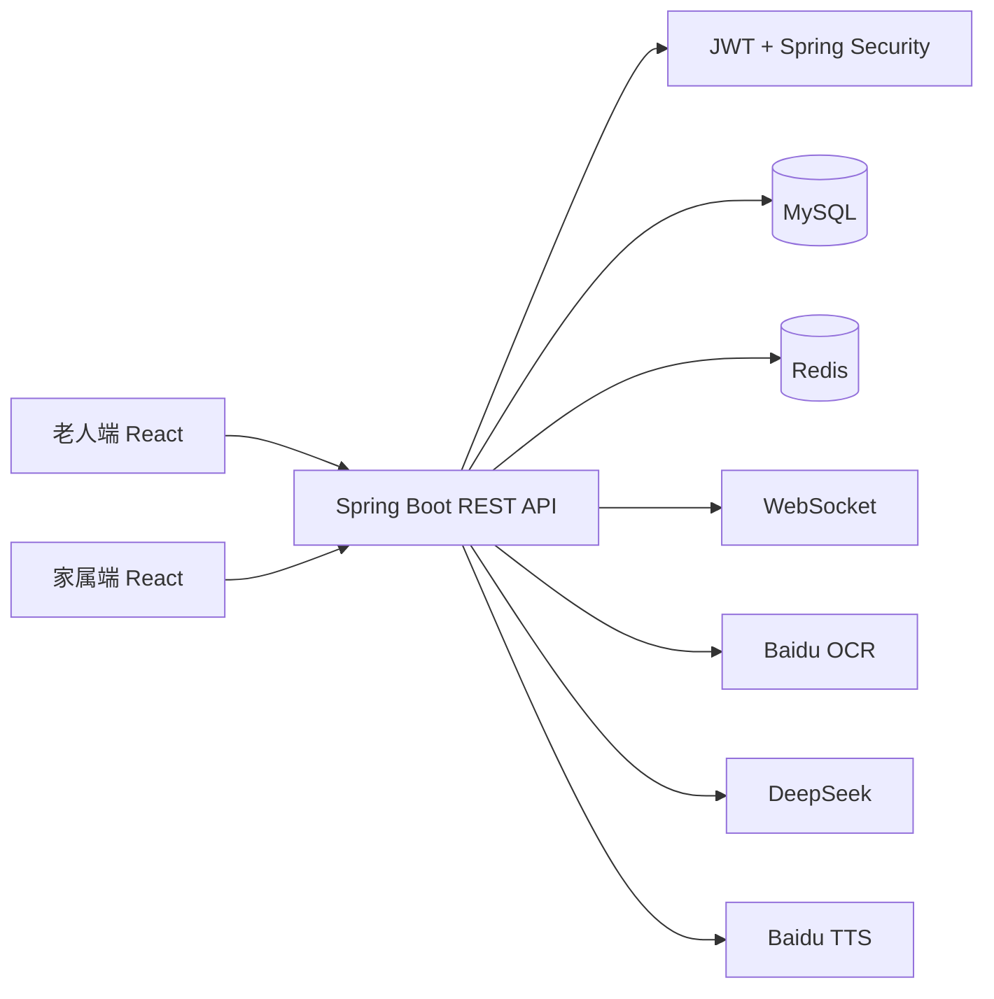
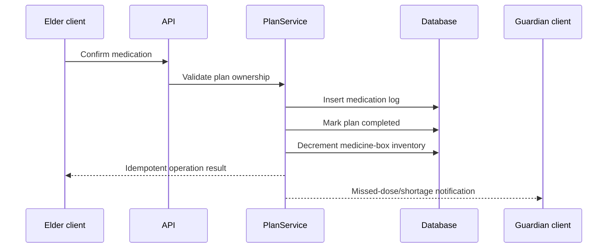

# AI Medication Safety Manager

## Architecture

The backend follows Controller -> Service -> Mapper -> MySQL layering. External AI/OCR/TTS calls stay behind service interfaces so that business flows can degrade gracefully when an external provider is unavailable.

## Core medication flow

## Engineering decisions

- JWT identity is read from `SecurityContext`; client-provided user IDs are never trusted for authorization or rate limiting.
- Medication confirmation is transactional so the log, plan status, and inventory update commit together.
- Expensive AI endpoints use per-user/IP fixed-window limiting.
- Production responses use a global exception handler and do not return raw exception messages.
